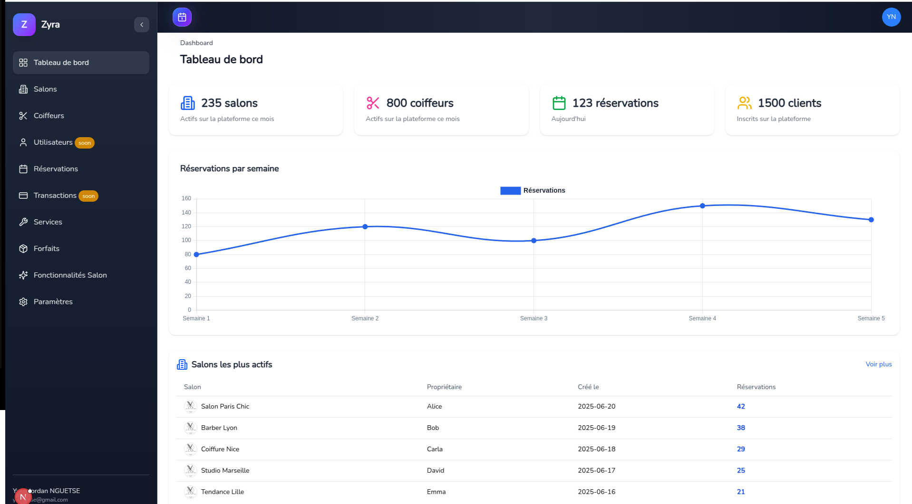
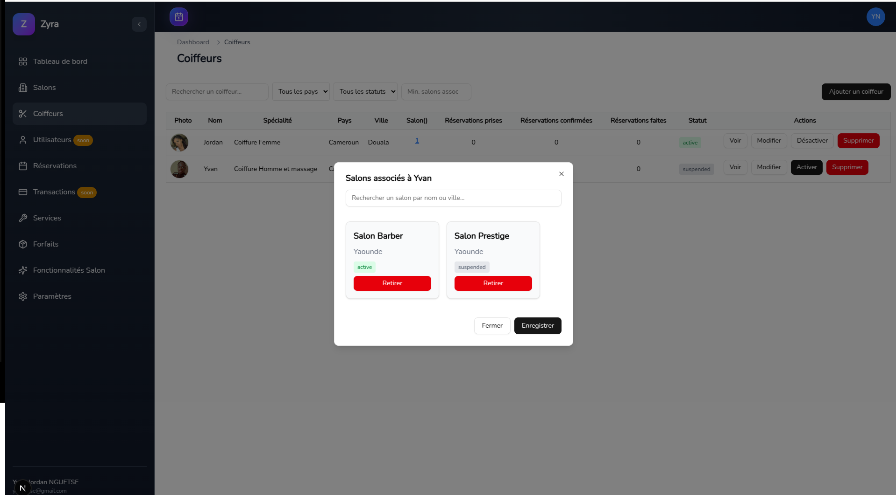
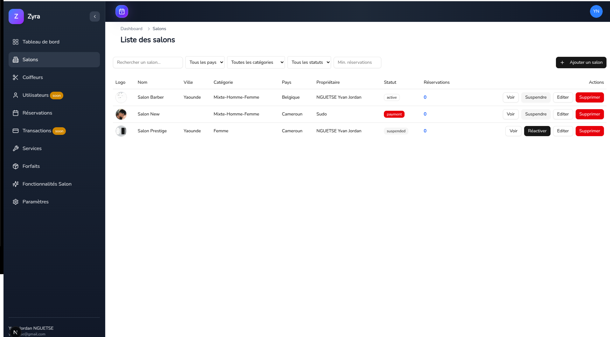
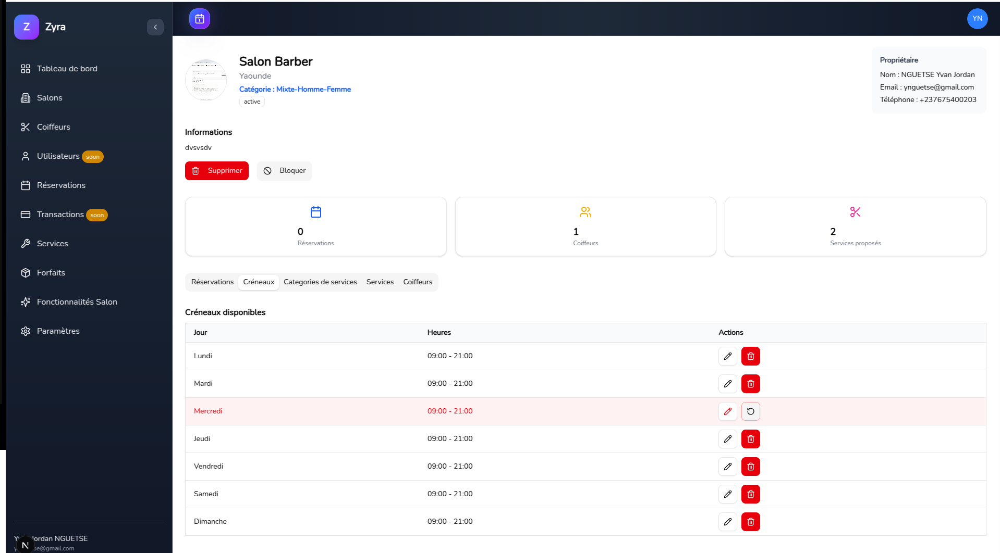
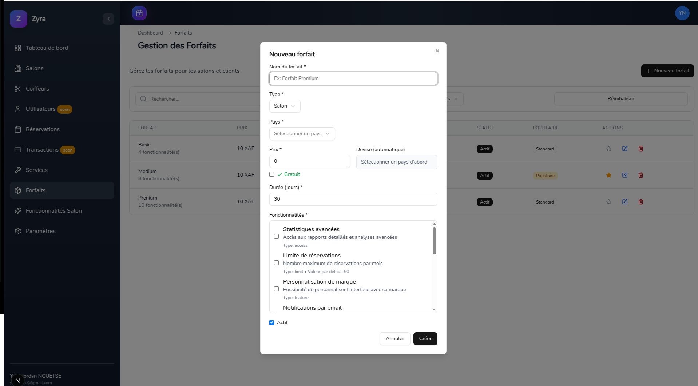

# 💇‍♀️ Zyra - Plateforme de Gestion de Salons de Coiffure

Zyra est une plateforme complète de gestion de salons de coiffure qui permet aux propriétaires de salons de gérer leurs coiffeurs, services, forfaits et réservations de manière efficace et moderne.

## 🌟 Fonctionnalités Principales

- 👥 **Gestion des Coiffeurs** - Administration complète du personnel
- 🏪 **Gestion des Salons** - Configuration et paramétrage des établissements
- 💼 **Gestion des Forfaits** - Création et gestion des packages de services
- 💳 **Système de Paiement** - Intégration Korapay (Carte & Mobile Money)
- 📊 **Tableau de Bord** - Statistiques et analytics en temps réel
- 🔐 **Authentification Sécurisée** - Firebase Auth
- 📱 **Interface Responsive** - Design adaptatif pour tous les écrans

## 🎨 Captures d'Écran

### 🏠 Tableau de Bord Admin
Interface principale d'administration avec vue d'ensemble des activités du salon.



### 👨‍💼 Gestion des Coiffeurs
Écran de gestion complète du personnel : ajout, modification, planning et performances.



**Fonctionnalités :**
- ➕ Ajouter de nouveaux coiffeurs
- ✏️ Modifier les informations du personnel
- 📅 Gestion des plannings et disponibilités
- 📈 Suivi des performances individuelles
- 🎯 Attribution des spécialisations

### 🏪 Gestion des Salons
Configuration et paramétrage des établissements avec localisation et services.





**Fonctionnalités :**
- 🏢 Informations de l'établissement
- 📍 Géolocalisation et adresse
- 🕒 Heures d'ouverture et fermeture
- 📞 Coordonnées de contact
- 🖼️ Galerie photos du salon
- ⚙️ Configuration des services

### 💼 Gestion des Forfaits
Création et administration des packages de services avec tarification flexible.



**Fonctionnalités :**
- 🎯 Création de forfaits personnalisés
- 💰 Tarification mensuelle/annuelle
- 📝 Description détaillée des services
- 🏷️ Catégorisation des forfaits
- 📊 Suivi des souscriptions
- 💳 Intégration paiement sécurisé

### ⚙️ Paramètres Système
Configuration avancée de la plateforme et personnalisation.


**Fonctionnalités :**
- 🌍 Configuration générale
- 👤 Gestion des profils utilisateurs
- 🔐 Paramètres de sécurité
- 💬 Préférences de notification
- 🎨 Personnalisation de l'interface
- 🔗 Intégrations tierces

## 🛠️ Technologies Utilisées

### Frontend
- **Next.js 14** - Framework React avec App Router
- **TypeScript** - Typage statique
- **Tailwind CSS** - Framework CSS utilitaire
- **shadcn/ui** - Composants UI modernes
- **Lucide React** - Icônes SVG

### Backend & Services
- **Firebase** - Authentication et base de données
- **Korapay API** - Système de paiement
- **Vercel** - Déploiement et hosting

### Outils de Développement
- **Turbo** - Monorepo build system
- **pnpm** - Package manager rapide
- **ESLint** - Linting JavaScript/TypeScript
- **Prettier** - Formatage de code

## 🏗️ Architecture du Projet

```
zyra/
├── apps/
│   ├── admin/          # Interface d'administration
│   └── salon/          # Interface salon propriétaire
├── packages/
│   ├── ui/             # Composants UI partagés
│   ├── conf/           # Configuration et services
│   ├── eslint-config/  # Configuration ESLint
│   └── typescript-config/ # Configuration TypeScript
├── docs/
│   └── screenshots/    # Captures d'écran
└── README.md
```

## 🚀 Installation et Développement

### Prérequis
- Node.js 18+
- pnpm 8+
- Compte Firebase
- Compte Korapay (pour les paiements)

### Installation

```bash
# Cloner le repository
git clone https://github.com/NY-Jordan/zyra1.0.git
cd zyra

# Installer les dépendances
pnpm install

# Configuration des variables d'environnement
cp .env.example .env.local
# Modifier .env.local avec vos clés API
```

### Configuration

1. **Firebase Setup**
```bash
# Créer un projet Firebase
# Configurer Authentication (Email/Password)
# Créer une base de données Firestore
```

2. **Korapay Setup**
```bash
# Créer un compte Korapay
# Récupérer les clés API (public/secret)
# Configurer les webhooks
```

3. **Variables d'environnement**
```env
# Firebase
NEXT_PUBLIC_FIREBASE_API_KEY=your_api_key
NEXT_PUBLIC_FIREBASE_AUTH_DOMAIN=your_domain
NEXT_PUBLIC_FIREBASE_PROJECT_ID=your_project_id

# Korapay
NEXT_PUBLIC_KORAPAY_PUBLIC_KEY=your_public_key
KORAPAY_SECRET_KEY=your_secret_key
```

### Développement

```bash
# Démarrer tous les apps en mode dev
pnpm dev

# Démarrer une app spécifique
pnpm dev --filter=admin
pnpm dev --filter=salon

# Build pour production
pnpm build

# Linting
pnpm lint
```

## 💳 Système de Paiement

### Méthodes Supportées
- 💳 **Cartes Bancaires** - Visa, Mastercard, Verve
- 📱 **Mobile Money** - MTN, Orange, Moov Money
- 🔒 **3D Secure** - Authentification renforcée
- 📲 **OTP/PIN** - Validation par code

### Fonctionnalités Avancées
- ✅ Validation en temps réel
- 🔄 Retry automatique en cas d'échec
- 📊 Suivi des transactions
- 🔔 Notifications de paiement
- 💾 Historique complet

## 🎨 Composants UI

Le projet utilise un système de design unifié avec des composants réutilisables :

### Ajout de Composants
```bash
# Ajouter un composant shadcn/ui
pnpm dlx shadcn@latest add button -c apps/admin
pnpm dlx shadcn@latest add dialog -c apps/salon
```

### Utilisation
```tsx
import { Button } from "@zyra/ui/components/button"
import { Dialog } from "@zyra/ui/components/dialog"
```

## 📱 Apps Disponibles

### Admin App (`/admin`)
- Port: `3000`
- Interface d'administration complète
- Gestion multi-salons
- Analytics avancées

### Salon App (`/salon`)
- Port: `3001`
- Interface propriétaire de salon
- Gestion simplifiée
- Focus sur l'opérationnel

## 🤝 Contribution

1. Fork le projet
2. Créer une branche feature (`git checkout -b feature/AmazingFeature`)
3. Commit les changements (`git commit -m 'Add AmazingFeature'`)
4. Push vers la branche (`git push origin feature/AmazingFeature`)
5. Ouvrir une Pull Request

## 📄 License

Ce projet est sous licence MIT. Voir le fichier `LICENSE` pour plus de détails.

## 👨‍💻 Auteur

**NY-Jordan** - [@NY-Jordan](https://github.com/NY-Jordan)

## 🙏 Remerciements

- [Next.js](https://nextjs.org/) - Framework React
- [shadcn/ui](https://ui.shadcn.com/) - Composants UI
- [Firebase](https://firebase.google.com/) - Backend as a Service
- [Korapay](https://korapay.com/) - Solution de paiement
- [Vercel](https://vercel.com/) - Plateforme de déploiement

---

<p align="center">
  Fait avec ❤️ pour les professionnels de la coiffure
</p>
